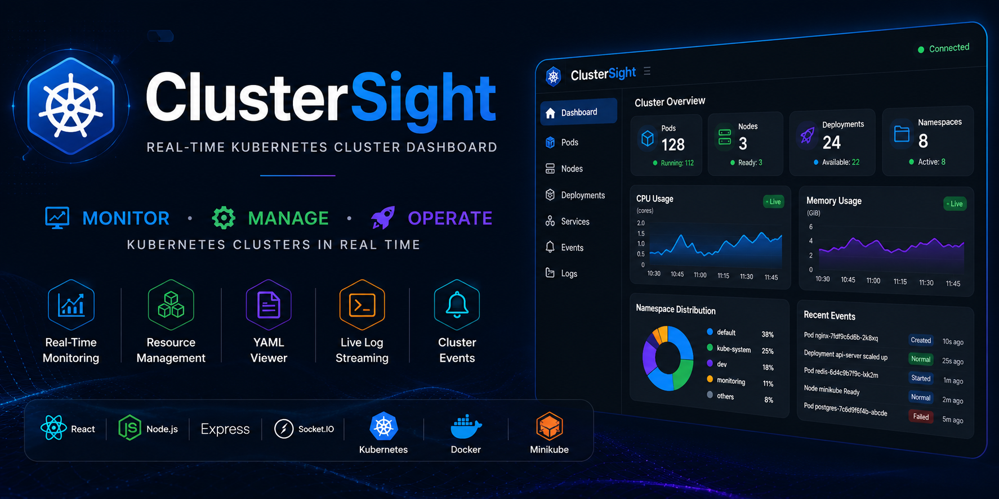
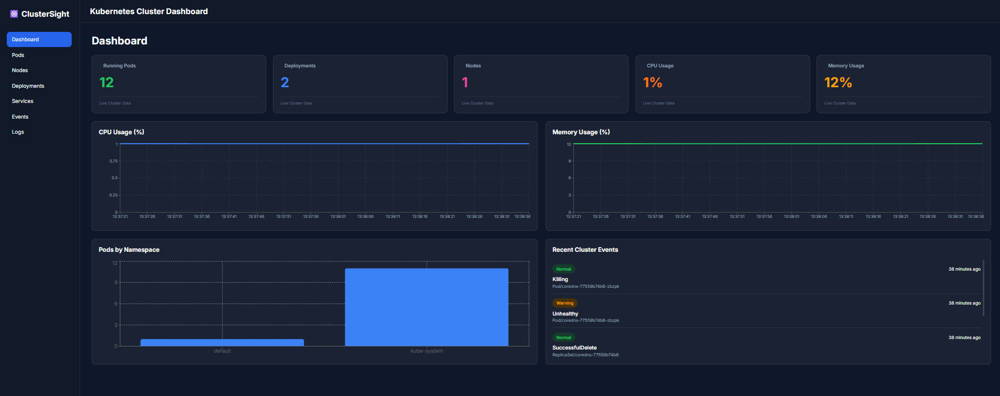
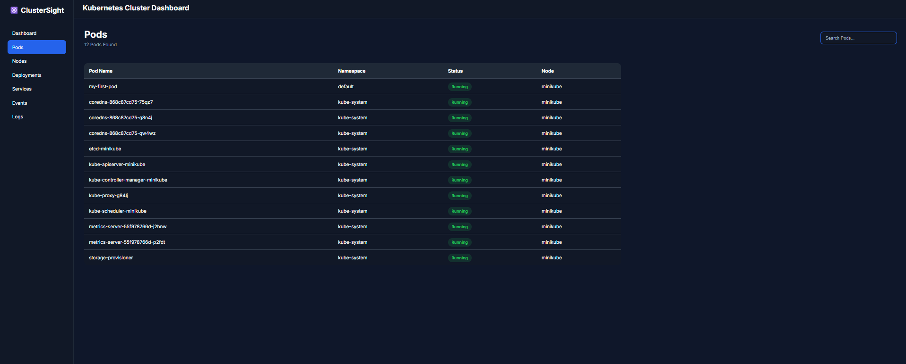
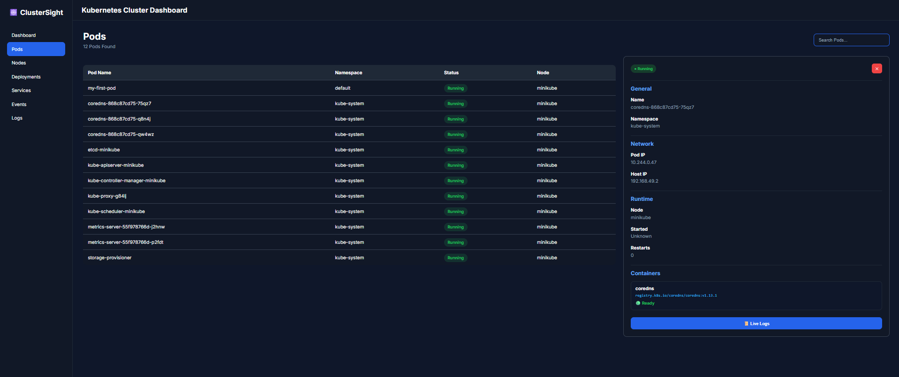
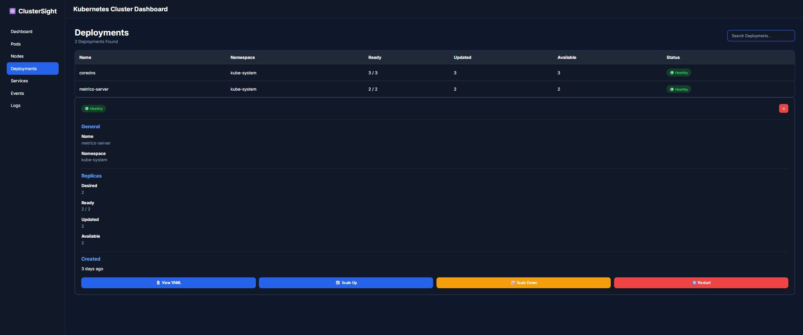
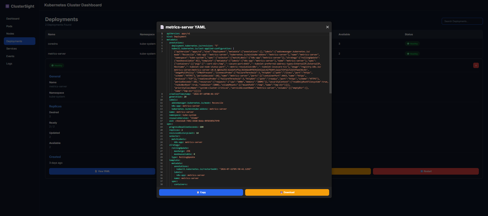
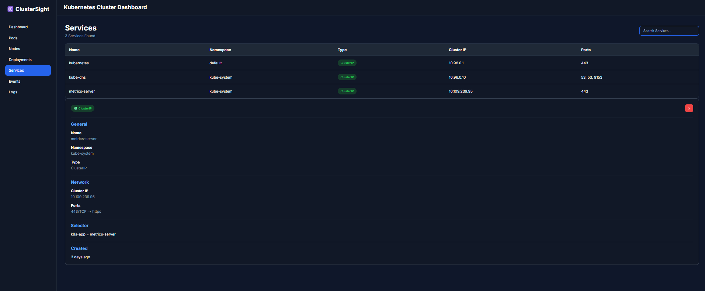
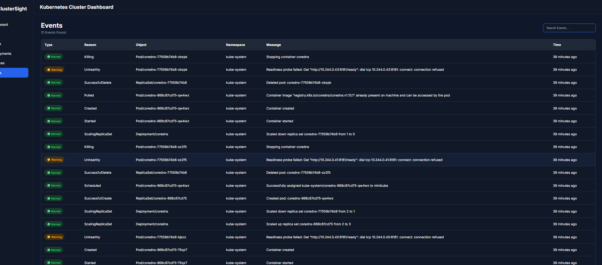
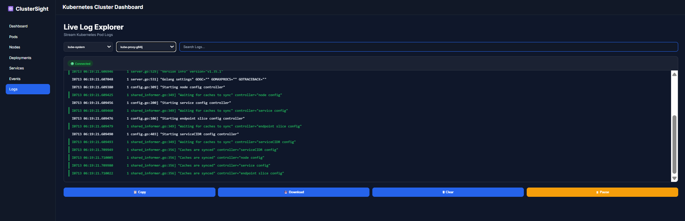

<div align="center">



# 🚀 ClusterSight

### Real-Time Kubernetes Cluster Dashboard

**Monitor · Manage · Operate Kubernetes Clusters in Real Time**

<br>


<br>


<br>


<br><br>

[**Features**](#-key-features) · [**Screenshots**](#-screenshots) · [**Architecture**](#️-architecture) · [**Installation**](#-installation) · [**API**](#-api-endpoints) · [**Troubleshooting**](#-troubleshooting)

</div>

---

## 📋 Table of Contents

- [Overview](#-overview)
- [At a Glance](#-at-a-glance)
- [Key Features](#-key-features)
- [Screenshots](#-screenshots)
- [Architecture](#️-architecture)
- [Tech Stack](#-tech-stack)
- [Folder Structure](#-folder-structure)
- [Installation](#-installation)
- [Usage](#-usage)
- [API Endpoints](#-api-endpoints)
- [Troubleshooting](#-troubleshooting)
- [Future Improvements](#-future-improvements)
- [Learning Outcomes](#-learning-outcomes)
- [Author](#-author)

---

## 🌟 Overview

**ClusterSight** is a developer-focused Kubernetes operations dashboard, built to monitor and manage cluster resources in real time. It's built with React, Express, and Socket.IO on top of the official Kubernetes client library, giving you a live, visual window into what's actually running in your cluster — pods, deployments, services, and events — with the ability to act on it: scale deployments, restart workloads, inspect YAML, and tail logs, all without touching a terminal.

**Why I built it:** `kubectl` is powerful but text-only, and I wanted a live, visual layer on top of it — something that made cluster state and log streams immediately readable without switching between terminal panes.

**Focus areas:** this project was as much about learning as building — specifically, Kubernetes API integration, real-time communication patterns with Socket.IO, and designing an operational dashboard that stays useful under live, changing cluster state rather than a static snapshot.

---

## ✅ At a Glance

<div align="center">

| | | |
|---|---|---|
| ✔ Real-Time Monitoring | ✔ Kubernetes API Integration | ✔ Live Log Streaming |
| ✔ Deployment Scaling | ✔ YAML Inspection | ✔ Socket.IO-Powered Updates |

</div>

---

## ✨ Key Features

### 📊 Dashboard
- Live cluster statistics
- CPU monitoring
- Memory monitoring
- Namespace distribution
- Recent cluster events

### 🧩 Pods
- Pod management
- Pod details view
- Search and filter
- Live pod logs

### 🚢 Deployments
- Scale up
- Scale down
- Restart deployment
- YAML viewer

### 🌐 Services
- Service details view

### 📅 Events
- Cluster event stream
- Dedicated dashboard widget

### 📜 Log Explorer
- Live log streaming
- Search within logs
- Pause / resume stream
- Copy to clipboard
- Download logs
- Color-coded log level highlighting

---

## 📸 Screenshots

<div align="center">

**Dashboard — live cluster overview**


<br><br>

**Pods — list and search**


<br><br>

**Pod Details — inspect a single pod**


<br><br>

**Deployments — scale and restart**


<br><br>

**Deployment YAML — inline resource viewer**


<br><br>

**Services — endpoint and port details**


<br><br>

**Events — cluster event stream**


<br><br>

**Live Logs — real-time streaming log explorer**


</div>

---

## 🏗️ Architecture

```
                Browser
                    │
                    ▼
          React Frontend (Vite)
           REST API │ WebSocket
                    ▼
          Express + Socket.IO
                    │
        Kubernetes Client API
                    │
                    ▼
          Minikube / Kubernetes
```

**Request flow:** the React frontend talks to the Express backend over REST for one-shot queries (pod lists, deployment details) and over a Socket.IO WebSocket connection for anything live — log streams and cluster events. The backend uses the official Kubernetes JavaScript client to talk to the cluster's API server, translating live cluster state into what the dashboard renders.

---

## 🛠️ Tech Stack

<div align="center">


</div>

| Layer | Technology |
|---|---|
| **Frontend** | React, React Router, Axios, Recharts, Socket.IO Client |
| **Backend** | Node.js, Express, Socket.IO, Kubernetes Client (`@kubernetes/client-node`) |
| **Infrastructure** | Docker Desktop, Minikube, `kubectl`, Metrics Server |

---

## 📁 Folder Structure

```
ClusterSight/
├── frontend/
│   ├── src/
│   │   ├── components/       # Reusable UI components (cards, charts, tables)
│   │   ├── pages/             # Route-level views (Dashboard, Pods, Deployments, etc.)
│   │   ├── services/          # API clients (Axios instances, Socket.IO connection)
│   │   └── App.jsx
│   └── package.json
│
├── backend/
│   ├── controllers/          # Request handlers for each resource type
│   ├── routes/                # Express route definitions
│   ├── websocket/             # Socket.IO event handlers (logs, live events)
│   └── server.js
│
├── assets/                    # Banner and screenshots
└── README.md
```

---

## ⚙️ Installation

### Prerequisites

- Node.js and npm
- Docker Desktop
- Minikube
- `kubectl`
- Metrics Server enabled on your cluster

### Setup

```bash
# 1. Clone the repository
git clone https://github.com/akshatsingh1427/ClusterSight.git
cd ClusterSight

# 2. Start the backend
cd backend
npm install
npm start

# 3. Start the frontend (in a new terminal)
cd frontend
npm install
npm run dev
```

The dashboard will be available at **http://localhost:5173** (or whichever port Vite reports), connecting to the backend at **http://localhost:5000**.

---

## ▶️ Usage

1. Make sure Minikube is running: `minikube start`
2. Start the backend and frontend as shown above
3. Open the dashboard in your browser
4. Browse pods, deployments, services, and events from the sidebar
5. Click into any pod for live logs, or any deployment for scale/restart controls and a YAML view

---

## ⚡ API Endpoints

| Endpoint | Method | Auth | Description |
|---|---|---|---|
| `/api/pods` | `GET` | None | List all pods across namespaces |
| `/api/nodes` | `GET` | None | List cluster nodes and their status |
| `/api/deployments` | `GET` | None | List all deployments |
| `/api/deployments/restart` | `POST` | None | Restart a specified deployment |
| `/api/deployments/scale` | `POST` | None | Scale a deployment up or down |
| `/api/events` | `GET` | None | Fetch recent cluster events |
| `/api/services` | `GET` | None | List all services |
| `/api/metrics` | `GET` | None | Fetch CPU/memory metrics (requires Metrics Server) |

> Live log streaming and real-time event updates are delivered over a Socket.IO connection rather than REST polling. Authentication is not currently implemented — see [Future Improvements](#-future-improvements).

---

## 🔧 Troubleshooting

### Recent Cluster Events Are Empty

Kubernetes Events are temporary and are automatically cleaned up by the cluster. If the Events panel looks empty, it's likely because there's simply nothing recent to show.

Generate fresh events to confirm the pipeline is working:

```bash
kubectl rollout restart deployment coredns -n kube-system
```

The dashboard will automatically pick up and display the new events.

### Metrics Not Showing / Metrics Server Not Enabled

CPU and memory panels rely on the Kubernetes Metrics Server. If they're blank, enable it on Minikube:

```bash
minikube addons enable metrics-server
```

It can take a minute or two after enabling before metrics start populating.

### Minikube Not Running

If the dashboard can't reach the cluster, confirm Minikube is actually up:

```bash
minikube status
minikube start
```

### Socket.IO Connection Issues

If live logs or live events aren't updating:
- Confirm the backend server is running and reachable at the URL configured in the frontend's Socket.IO client
- Check the browser console for WebSocket connection errors
- Make sure no firewall or proxy is blocking WebSocket upgrades on the backend port

---

## 🎓 Learning Outcomes

Building ClusterSight involved working through:

- Kubernetes API integration using the official JS client
- Real-time communication with Socket.IO (as distinct from REST polling)
- Designing an operational dashboard that stays accurate under live, changing state
- React component architecture for data-heavy, frequently-updating views
- Express REST API design for cluster resource endpoints
- Parsing and rendering raw Kubernetes YAML resources
- Implementing deployment operations (scale, restart) safely from a UI

---

## 🔮 Future Improvements

- [ ] Authentication & RBAC-aware views
- [ ] Multi-cluster support
- [ ] Prometheus integration
- [ ] Grafana integration
- [ ] Helm chart support
- [ ] Namespace management UI
- [ ] In-dashboard resource editing

---

## 👨‍💻 Author

<div align="center">

**Akshat Singh**

<a href="https://github.com/akshatsingh1427">
  
</a>
<a href="https://www.linkedin.com/in/akshat-singh-ba248b394/">
  
</a>

</div>

<div align="center">

**Built to make Kubernetes operations visible, live, and actionable.**

</div>
